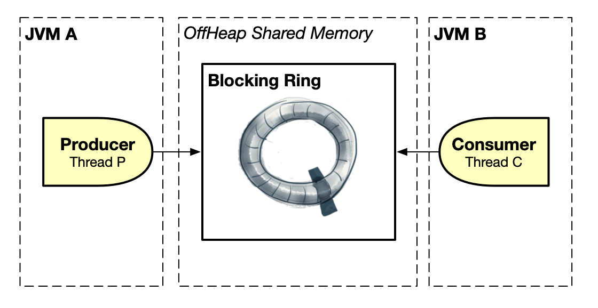
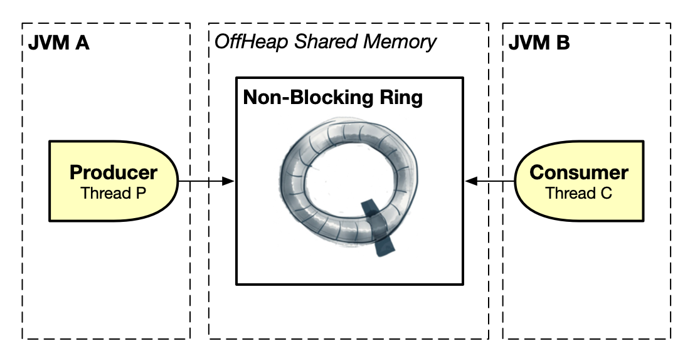
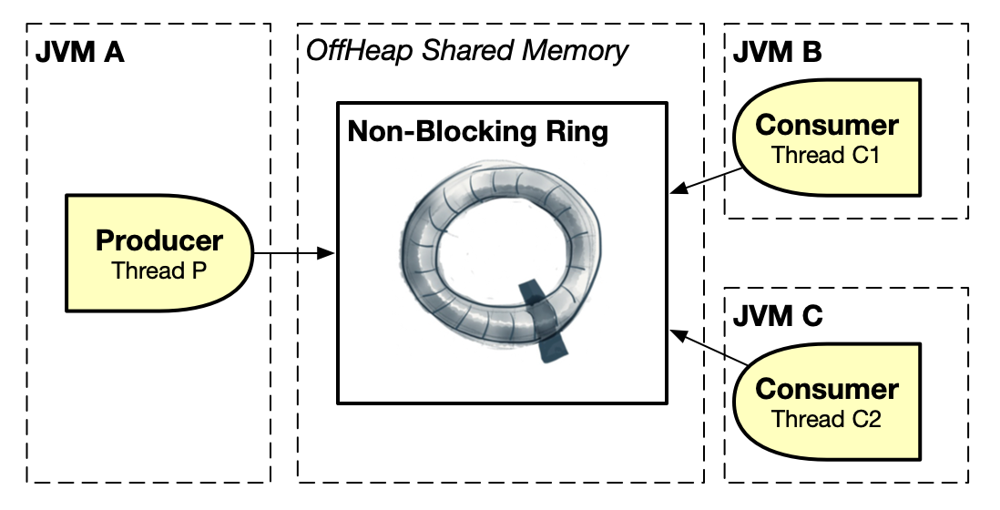

# CoralRing

CoralRing is an ultra-low-latency, lock-free, garbage-free, batching and concurrent circular queue (_ring_)
in off-heap shared memory for inter-process communication (IPC) in Java across different JVMs using memory-mapped files.

An interesting characteristic of _memory-mapped files_ is that `they allow your shared memory to exceed the size of your machine physical memory (RAM) by relying on the OS's virtual memory mechanism`. Therefore your shared memory is limited not by your RAM but by the size of your hard drive (HDD/SSD). The trade-off of a large memory-mapped file is performance as the OS needs to swap pages back and forth from the hard drive to memory and vice-versa, in a process called _paging_.

For maximum performance (lowest possible latency) you should place your memory-mapped file inside the Linux `/dev/shm/` folder so that the contents of your file are entirely kept in RAM memory. Of course by doing so you are back to being limited to your available RAM memory. CoralRing uses a _circular_ queue (_ring_) in shared memory so even with a small piece of memory you can transmit an unlimited number of messages to the other process.

For some performance numbers you can check [this link](https://www.coralblocks.com/index.php/inter-process-communication-with-coralqueue/).

## Blocking Ring



Because the ring is a _bounded_ circular queue, the first approach is to have a _blocking_ producer and consumer. In other words, the ring producer will block (_wait_) when the ring is full and the ring consumer will block (_wait_) when the ring is empty. The consumer reads the messages (all the messages) in the same order that they were sent by the producer.

- Click [here](src/main/java/com/coralblocks/coralring/example/ring/minimal/MinimalBlockingProducer.java) for a minimal example of using blocking ring producer
- Click [here](src/main/java/com/coralblocks/coralring/example/ring/minimal/MinimalBlockingConsumer.java) for a minimal example of using blocking ring consumer
<br/><br/>
- Click [here](src/main/java/com/coralblocks/coralring/example/ring/BlockingProducer.java) for a basic example of using blocking ring producer
- Click [here](src/main/java/com/coralblocks/coralring/example/ring/BlockingConsumer.java) for a basic example of using blocking ring consumer

Note that for maximum performance the producer and consumer should busy spin when blocking. However you can also choose to use a _wait strategy_ from [CoralQueue](https://github.com/coralblocks/CoralQueue).

## Non-Blocking Ring



Things get more interesting when we allow the ring producer to write as fast as possible without ever blocking on a full ring. Because the ring is a _circular_ queue, the producer can just keep writing forever, overwriting the oldest messages on the head of the queue with the newest ones. In this new scenario, a _lagging consumer_ that falls behind and loses messages will simply disconnect (give up) _instead of causing the producer to block_. It has to disconnect because it must never skip messages from the producer.
```Java
long avail = ringConsumer.availableToPoll();
			
if (avail == 0) continue; // busy spin as the ring is empty
			
if (avail == -1) throw new RuntimeException("The consumer fell behind too much! (ring wrapped)");
```

This lagging consumer problem can be mitigated by creating a large memory-mapped file so that your shared memory ring is big enough to give room for the consumer to fall behind and catch up. However there is a more important issue that we need to address with a non-blocking ring which is when the consumer falls behind so much that it hits the _edge_ of the circular ring. When that happens there is a _small chance_ that the consumer will be reading the oldest message in the ring at the same time that the producer is overwriting it with the newest message. In other words, the consumer can _trip over_ the producer.

### Using a _fall behind tolerance_

The _tripping over_ problem will _only_ happen when the consumer falls behind N messages, where N is equal to the capacity of the ring. If it falls behind a little more, it simply disconnects. If it falls behind a little less it _should_ still be able to read the next message without any issues. `So the bigger the capacity of the ring the less likely it is for the consumer to trip over the producer` because the more room it has to fall behind safely. Therefore, to reduce the chances for the consumer to get close to the edge, we can introduce a _fall behind tolerance_, in other words, `we can make the consumer give up and disconnect early when it falls to a percentage P of the capacity of the ring`.

Unfortantely, although this will further reduce the chances for the consumer to read a corrupt message, it does not make it zero. Theoretically, the slowness of the consumer is so _unpredictable_ that while it is reading a message there will always be a small chance that the producer is overwriting it. If we really want to eliminate this possibility completely we must use a _checksum_ for each message.

The constructor of `NonBlockingConsumer` can take a _float_ argument `fallBehindTolerance` to specify the percentage of the ring capacity to fall behind before disconnecting, in other words, before `availableToPoll()` returns `-1`.

### Using a _checksum_ for each message

To completely solve the _corrupt message_ consumer problem, we can make the producer write a _checksum_ together with each message so that the consumer can check the integrity of the message after it reads it. Although we use a _fast_ hash algorithm ([_xxHash_](https://github.com/apache/drill/blob/master/exec/java-exec/src/main/java/org/apache/drill/exec/expr/fn/impl/XXHash.java](https://xxhash.com/))) to calculate the checksum, there is a small performance penalty to pay when you choose this approach.

The constructor of `NonBlockingProducer` can take a _boolean_ argument `writeChecksum` to tell the producer to write the _checksum_. The constructor of `NonBlockingConsumer` can take a _boolean_ argument `checkChecksum` to tell the consumer to check the _checksum_. The consumer can check for a _checksum error_ by checking for a `null` value returned from `poll()` or `peek()` :
```Java
for(long i = 0; i < avail; i++) {
      
    MutableLong ml = ringConsumer.poll();
      
    if (ml == null) {
        throw new RuntimeException("The consumer tripped over the producer! (checksum failed)");
    }
      
    // (...)
}
```

Note that when using the _checksum_ approach there is no reason to also use a _fall behind tolerance_. You can catch the exception, assume that the consumer has fallen behind too much and disconnect (give up).

- Click [here](src/main/java/com/coralblocks/coralring/example/ring/minimal/MinimalNonBlockingProducer.java) for a minimal example of using non-blocking ring producer
- Click [here](src/main/java/com/coralblocks/coralring/example/ring/minimal/MinimalNonBlockingConsumer.java) for a minimal example of using non-blocking ring consumer
<br/><br/>
- Click [here](src/main/java/com/coralblocks/coralring/example/ring/NonBlockingProducer.java) for a basic example of using non-blocking ring producer
- Click [here](src/main/java/com/coralblocks/coralring/example/ring/NonBlockingConsumer.java) for a basic example of using non-blocking ring consumer

## Non-Blocking Multicast Ring

A non-blocking ring can be used naturally to implement _multicast consumers_. In other words, `you can have multiple non-blocking ring consumers reading from the same non-blocking ring producer`. All consumers will read all messages in the exact same order. A consumer can still fall behind and disconnect, but it will never miss a message or process a message out of order.



CoralRing is great for threads running in different JVMs. But how about threads running inside the _same JVM_? For that you can check our [CoralQueue](https://github.com/coralblocks/CoralQueue) project which is a collection of circular data structures for inter-thread communication in Java.
